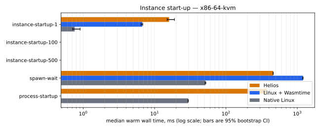
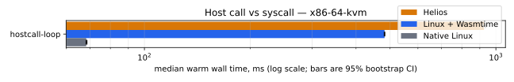
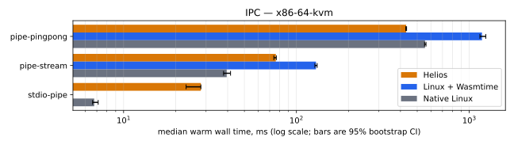
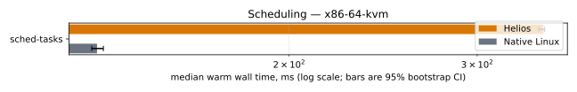
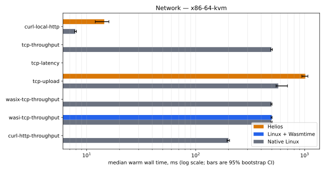
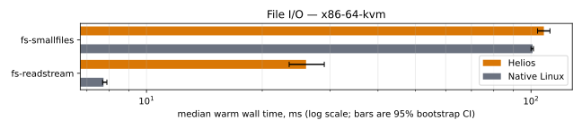
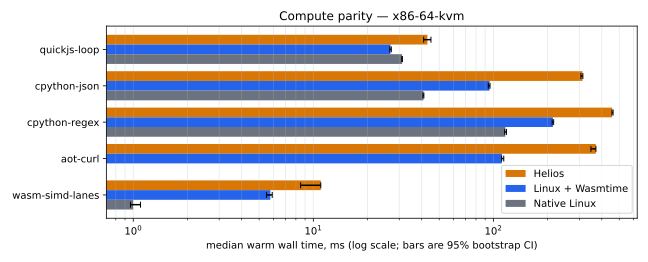

# Benchmarks

Helios is designed around wasm end to end, so the claims worth making are
about what that buys: how fast an instance starts, what a host call costs
against a syscall, how fast two programs talk, what a context switch
costs, and whether the in-kernel network and file paths keep up with
Linux. This page states exactly what is compared, how the numbers are
taken, and how to reproduce any of them from a tag.

The tooling lives in `tools/bench/` (`helios-bench`, a `uv` project); the
workload definitions in `tools/wasi-apps/workloads.json`; the CI workflow
in `.github/workflows/bench-suite.yml`. Nothing on this page is measured
on a developer machine.

## What is compared

Three sides, on one machine, in one workflow run:

| Side | What runs | Where |
| --- | --- | --- |
| Helios | the kernel under QEMU, programs as signed `cwasm` | `helios-inspector vm … workload-bench` |
| Linux + Wasmtime | the same wasm, precompiled by `wasmtime compile` from the same Wasmtime release Helios vendors, run by `wasmtime run --allow-precompiled` inside a Fedora guest | `tools/wasi-apps/fedora_qemu_baseline.py` |
| Native Linux | a C or distribution-native equivalent inside the same Fedora guest | same guest, `tools/bench/native/*.c` |

Every side gets the same QEMU release, accelerator (KVM), vCPU count,
memory, virtio block/net/rng devices,
and network backend. The pins are in `tools/bench/manifest.toml`; the
runner refuses to start on a host that deviates from its lane unless the
run is explicitly advisory, in which case the deviations are written into
the report and the report is marked non-publishable.

The Linux guest is a Fedora Cloud Base image pinned by SHA256 in
`tools/wasi-apps/fedora_qemu_baseline.py`; the Wasmtime release it runs is
pinned there too and must match the vendored tree in
`.github/actions/checkout-wasmtime/action.yml` (the report records both).
Helios cannot load the Linux `cwasm` and Linux cannot load the Helios
one: Cranelift emits for `aarch64-unknown-none` on one side and
`aarch64-unknown-linux` on the other, so "same AOT artifact" means the
same wasm input, the same compiler revision, and the same optimisation
level, with both artifacts' SHA256 recorded in the report.

## Workloads

Each workload isolates one design claim; its class names that claim, and
its `counterparts` in `workloads.json` say what the Linux sides run. A
`null` counterpart is reported as uncovered, never approximated.

| Class | Workload | Helios | Linux + Wasmtime | Native Linux |
| --- | --- | --- | --- | --- |
| startup | `instance-startup-{1,100,500}` | `procbench startup N hello hold` through `helios:system/programs`; time to first stdout byte per instance, memory per instance as the drop in `helios:system/stats` available memory while all are alive | `procbench` spawning `wasmtime run --allow-precompiled hello.cwasm hold` | `procbench` spawning the C `hello`; RSS from `/proc` |
| startup | `spawn-wait` | 200 sequential spawn+wait | same, Wasmtime child | same, native child |
| startup | `process-startup` | 20 × `dash -c true` | — | same |
| hostcall | `hostcall-loop` | 2 000 000 × `wasi:clocks/monotonic-clock.now` | same wasm | 2 000 000 × `clock_gettime(CLOCK_MONOTONIC)` |
| ipc | `pipe-pingpong` | 20 000 × 64-byte round trip through a child's stdin/stdout | Wasmtime `pipe-echo` child | C `pipe-echo` child |
| ipc | `pipe-stream` | 64 MiB through the child | same | same |
| ipc | `stdio-pipe` | coreutils pipeline | — | same |
| sched | `sched-tasks` | 64 cooperative tasks × 2000 `yield_now` (one host call each) | — (Wasmtime has no cooperative scheduler for a CLI program) | 64 threads × 2000 `sched_yield` |
| net | `tcp-throughput`, `tcp-upload`, `wasi-tcp-throughput`, `wasix-tcp-throughput`, `curl-*` | 64 MiB streams through the in-kernel stack | `wasi-tcp-throughput` only | Python client / curl |
| net | `tcp-latency` | 5000 × 16-byte round trip to a host echo server | same wasm | C client with `TCP_NODELAY` |
| fs | `fs-smallfiles`, `fs-readstream` | coreutils on the embedded filesystem root | — | ext4 in the guest |
| compute | `quickjs-loop`, `cpython-json`, `cpython-regex`, `wasm-simd-lanes` | interpreter or SIMD loops | same wasm | native QuickJS/CPython/NEON-or-SSE probe |
| compute | `aot-curl` | compiler plugin AOT of `curl.wasm` | `wasmtime compile` of the same input | — |

`headline: true` marks the rows the README table and the regression gate
carry. Compute is a parity check, not a claim: Helios running the same
wasm on the same Cranelift must be within noise of Linux + Wasmtime, and
a significant loss there is flagged `parity_bug` in the report and filed
as a bug rather than reported as a number.

Workloads print secondary measurements as `bench.<name>=<value>` lines
(latency percentiles, bytes per instance, switches per second); both
harness sides collect them into the report so they can be compared
without either side knowing about the other.

Known limits recorded by the suite itself:

- The pooling allocator caps live component instances at Wasmtime's
  default of 1000, system programs included, so the density set stops at
  500 instances until that limit is a kernel decision.
- `fs-*` runs on the embedded filesystem root, not on a block device;
  a virtio-blk-backed filesystem (issue #15) is what makes the file I/O
  class comparable to ext4.
- The network class needs a multi-queue `tap` with vhost-net to mean
  anything: slirp is single-queue with no offload, so a run taken on one
  measures neither the driver's multiqueue path nor its checksum and TSO
  paths (docs/networking.md).

## Statistics

Per cell (workload × side), `iterations` executions (11 by default):

- The first `warmup_discard` (1) is the **cold** series and is reported
  separately; the remaining ten are the **warm** series every headline
  number and the gate use.
- Per series: median, quartiles and IQR, mean, standard deviation,
  coefficient of variation, min and max, and a percentile-bootstrap 95%
  interval of the median from 10 000 resamples drawn with a fixed seed
  (`bootstrap_seed` in `manifest.toml`), so the interval in a report can
  be recomputed from its raw iterations.
- A warm series whose CV exceeds `cv_bound` (0.15) is **rejected**: it is
  printed with a marker, excluded from comparisons and from the gate.
- A workload a side could not measure at all is a **failed** cell, not a
  missing one: every harness runs with `--keep-going`, records the
  failure and its reason, and goes on to the next workload, so a report
  accounts for every cell of the matrix. A failed cell takes part in no
  comparison and the reason is printed under the class table.
- A workload that takes the guest down with it costs its own class and no
  other. The Helios side boots one guest per workload class, so a kernel
  panic ends that class: the inspector's frame reader recognises the
  kernel's panic line on the console it shares with the RPC frames and
  fails the call in flight instead of waiting for a reply that a dead
  kernel will never send, the workloads that class never reached are
  written out as failed cells naming the panic, and the next class starts
  a fresh guest. The lane still fails — a report with a panic in it is
  not publishable — but it fails with every cell it could still measure.
- Machine noise is measured, not assumed: the `control_workload`
  (`quickjs-loop`) runs before and after the suite on every side, and the
  **noise floor** is the larger of the control's median drift and its CV.
- A comparison between Helios and a Linux side is **significant** when
  the two warm bootstrap intervals do not overlap and the ratio of medians
  moves by more than the noise floor; otherwise it prints "within noise".
- The regression gate compares a candidate report against the newest
  `dev` report of the same lane and calls a headline workload regressed
  when its Helios warm intervals are disjoint and the median moved by more
  than the larger of the two runs' noise floors. It blocks only when both
  reports are publishable, i.e. from dedicated runners; on advisory reports
  it comments the table on the pull request.

## Reports and where the numbers come from

One `report.json` per lane per run (schema in
`tools/bench/src/helios_bench/report.py`): hardware, every pin including
the SHA256 of every wasm and `cwasm` the run used, every iteration of
every cell, the statistics above, the comparisons and verdicts, and the
run's GitHub id. It is uploaded as the `bench-report-<lane>` workflow
artifact, and on a tag it is attached to the release so a paper can cite
the tag.

Every number in this repository's documentation is traceable to one run
id: `helios-bench render readme --run <id>` and `render docs --run <id>`
only render from reports committed under `docs/benchmarks/runs/<id>/`
(fetched with `helios-bench fetch --run <id>`), they refuse a report whose
own run id differs, and the `tooling` job of the workflow re-renders the
committed sections and fails when the text no longer matches the report.

## Cells that are known to fail

A red cell in a published table is either a bug of ours with an issue
number or a limit of the runner, and the table says which. The report's
`failures` map carries the harness's own reason for every one of them, so
the table is generated from what the run actually saw rather than from
this page.

These are the cells that failed in run 33959252438, the run the results
below are rendered from, and why:

| Cell | Sides | Why |
| --- | --- | --- |
| `instance-startup-100`, `instance-startup-500` | Helios | The kernel heap was a fixed quarter of the guest and an instance costs it ~8.1 MiB, so the 46th spawn was refused with a typed `SpawnErrorKind::OutOfMemory` while the user pool was untouched (#130, fixed since; see `docs/memory.md`). The ceiling is now the executor's fixed 768 KiB instance task share at about ninety instances (#159). Their Linux halves are skipped by name: a cell whose Helios half cannot be measured has nothing to compare against. |
| `tcp-throughput`, `wasi-tcp-throughput`, `wasix-tcp-throughput` | Helios | The guest receive path stops answering and the workload's own deadline fails it (#143). |
| `curl-http-throughput` | Helios | Never reached: the `net` class spent its share of the Helios side's budget on the three cells above and was killed at 589 s, so this one is recorded as unmeasured rather than left out. |
| `tcp-latency` | all three | The driver bound the host echo server to 127.0.0.1 while every side reaches the host at the lane's `net_host` (10.77.0.1 on this lane), so no side could connect and all three exited non-zero (#150, fixed since). |

The refusal behind #130 was correct for the pool it was asked about and
wrong about which pool had run out. `docs/memory.md` states the
relationship between guest memory and the two domains that replaced it:
all usable memory is user pool and the kernel heap draws on it, so the
instance ceiling is a property of the guest's memory. With that fixed the
density workload reaches instance 104 and is refused by the executor's
fixed 768 KiB instance task share instead (#159), so both density cells
stay out of the gating set against that limit rather than a memory one.

The per-processor task arena that #132 records — where the density cells'
refused spawns cost every later spawn in the same guest — did not recur
in this run: `spawn-wait` and `process-startup` were both measured after
them.

### Nothing in the run is unbounded

A guest that stops answering is the failure mode this suite meets most
often, and it is bounded three times over, because each bound catches
what the one below it cannot see.

- **Per iteration.** Every workload iteration runs under
  `--workload-timeout-seconds`; the iteration that elapses is a failed
  cell naming the workload and the iteration.
- **Per guest step.** The steps around the workloads — the profiler
  hand-off, the profile and metric reads, the tracing fetch — talk to the
  same guest, so they run under the same deadline. Without that, a run
  whose workloads were all recorded still sat on a dead VM: run
  33952047436 hung there for ninety-five minutes with QEMU alive behind
  it, until CI cancelled the job.
- **Per side.** `--helios-side-timeout-seconds` bounds the whole Helios
  side, control runs included, and the classes share what is left of it
  as they run. A boot that never reaches the debugger answers no
  deadline at all, so this is what keeps a wedged class costing one
  class rather than the lane. The Linux side has had the same bound as
  `--side-timeout-seconds` since it lost a side to one hung workload.

The bugs the first runs of this suite found are fixed: the x86 kernel
refusing a multi-queue `vhost` tap (#91), a user-mode spawn storm
panicking the kernel through the task arena (#94), the OOM killer
condemning a fresh victim per grow attempt (#100) and then panicking on
an already-inactive instance (#114), the guest receive path stalling
around 300 KB (#93), and two guests sharing one runtime directory (#98).
A cell that fails now is news, and belongs in a new issue quoted from the
report.

## One lane, and why

The suite measures **x86-64 Linux under KVM** and nothing else.

Nearly everything it measures — the executor, the component host, the
host-call path, the in-kernel network stack, the block and pipe paths —
lives in the architecture-neutral `kernel/` crate, so a second
architecture repeats the same code through a different backend rather
than covering new ground. What is genuinely per-architecture (trap entry,
IRQ delivery, MMIO, SMP bring-up) is covered by the smoke lanes, which
boot every backend on every change.

There is also no hosted runner that could carry a second lane. GitHub's
Arm runners expose no `/dev/kvm` (probe run 33944339758) and no readable
`/dev/vhost-net`, so an Arm lane there would be an interpreter measuring
an interpreter behind a userspace tap: a different machine, not a noisier
one, which changes what is fast relative to what — the one thing a
benchmark exists to measure.

An aarch64 number therefore comes from a dedicated Apple Silicon machine
or a developer's own arm64 box, taken by hand with the same harness
(`helios-bench run --lane …` against a lane added to `manifest.toml` for
that machine), never from hosted CI. AGENTS.md §3.5's arm64 baseline is
that kind of measurement.

## Dedicated runners

Publishable numbers come from a self-hosted machine registered with this
label:

| Lane | Label | Host | Accelerator | Advisory stand-in |
| --- | --- | --- | --- | --- |
| `x86-64-kvm` | `helios-bench-x86-kvm` | x86-64 Linux, `/dev/kvm` | KVM | `ubuntu-24.04` |

Requirements the manifest's host check cannot verify and the machine's
owner must guarantee: the CPU frequency governor is fixed
(`performance`), turbo behaviour is the same for every run, nothing else is
scheduled on the machine while the workflow runs, the same QEMU release
is installed as the lane pins, and the network backend is the lane's
(a `tap` device driven by vhost-net, the only host packet path with more
than one queue and any offload — see docs/networking.md).

Until that machine exists, the lane runs on its hosted stand-in in
**advisory** mode: the report carries `publishable: false`, the README
says so, and nothing blocks. The stand-in has the lane's accelerator and
its network backend; what it cannot promise is an idle machine or a fixed
governor. The repository variable `HELIOS_BENCH_DEDICATED=true` turns on
the dedicated-runner runs for pushes to `dev`; tags always use the
dedicated label.

Every difference between the host a run is taken on and the lane it
claims is recorded by `host-check` and listed in the report's
`deviations`, and any deviation at all makes the report
`publishable: false`.

## Reproducing a published number

```bash
git checkout <tag>
cd tools/bench && uv sync
uv run helios-bench host-check --lane x86-64-kvm     # must print no deviation
uv run helios-bench run --lane x86-64-kvm --out-dir ../../target/bench/x86-64-kvm
uv run helios-bench render tables --report ../../target/bench/x86-64-kvm/report.json
```

`run --dry-run` prints the exact harness commands and the host
deviations without running anything. `--sides helios` or
`--sides linux_native,linux_wasmtime` runs one side; `--workload` repeats
to select workloads. The runner drives `tools/wasi-apps/linux-gap-bench.py`
for both sides; every intermediate file (per-class JSONL, the guest's
JSONL, the Fedora provisioning logs) stays under the output directory.

## Reading the plots

`helios-bench render plots` draws one SVG per class and one for the
headline set. Class plots show the median warm wall time per side on a
log axis with the bootstrap interval as error bars: shorter is better,
and two bars whose error bars overlap are not distinguishable. The
headline plot shows Helios's speed-up over each Linux side (other median
over Helios median, log axis): right of the 1x line Helios is faster,
left of it Helios is slower, and bars inside the noise floor mean nothing.

## Results

<!-- helios-bench:begin run=33959252438 -->
Rendered from CI run [33959252438](https://github.com/lexoliu/helios/actions/runs/33959252438) by `helios-bench render docs --run 33959252438`; the reports it was rendered from are committed under `docs/benchmarks/runs/33959252438/`.

### Lane `x86-64-kvm`

Advisory: this report is from `GitHub Actions 1000006547`, not a dedicated runner. Its numbers show the shape of the comparison, not a publishable result.

| Pin | Value |
| --- | --- |
| Helios | `5b9c36c5cf28e2bc51ae3514d23d1b31f2f236c6` |
| Vendored Wasmtime | `6bbaceda21b3de992508f1c26e45f66bfd175e68` |
| Wasmtime on Linux | `wasmtime-v48.0.0-x86_64-linux` |
| Fedora image | `28680fe5b371a5a8…` |
| QEMU | pinned `8.2.2`, ran `8.2.2` |
| Guest | 4 vCPUs, 6G (Helios) / 4G (Linux), `tap` network, virtio-blk-pci, virtio-net-pci, virtio-rng-pci |
| Host | AMD EPYC 7763 64-Core Processor, 4 logical CPUs, kvm |
| Noise floor | +15.1% from `quickjs-loop` before and after the suite |

#### Instance start-up



| Workload | Helios | Linux + Wasmtime | Native Linux | vs Wasmtime | vs native |
| --- | ---: | ---: | ---: | ---: | ---: |
| `instance-startup-1` | 16.0 [15.0, 19.0] (rejected) | 6.74 [6.45, 6.83] | 0.76 [0.71, 0.91] | n/a | n/a |
| `instance-startup-100` (headline) | **failed** | n/a | n/a | n/a | n/a |
| `instance-startup-500` | **failed** | n/a | n/a | n/a | n/a |
| `spawn-wait` (headline) | 460 [458, 460] | 1,200 [1,189, 1,207] | 51.6 [50.8, 52.4] | 2.61x | 0.11x |
| `process-startup` | 374 [334, 414] | n/a | 29.6 [29.4, 29.7] | n/a | 0.08x |

#### Host call vs syscall



| Workload | Helios | Linux + Wasmtime | Native Linux | vs Wasmtime | vs native |
| --- | ---: | ---: | ---: | ---: | ---: |
| `hostcall-loop` (headline) | 925 [918, 934] | 482 [481, 483] | 68.3 [68.2, 68.7] | 0.52x | 0.07x |

#### IPC



| Workload | Helios | Linux + Wasmtime | Native Linux | vs Wasmtime | vs native |
| --- | ---: | ---: | ---: | ---: | ---: |
| `pipe-pingpong` (headline) | 432 [429, 434] | 1,185 [1,153, 1,246] | 555 [551, 562] | 2.75x | 1.29x |
| `pipe-stream` | 76.0 [74.0, 76.5] | 130 [128, 132] | 39.5 [37.9, 41.6] | 1.71x | 0.52x |
| `stdio-pipe` | 28.0 [23.0, 28.0] | n/a | 6.76 [6.62, 7.13] | n/a | 0.24x |

#### Scheduling



| Workload | Helios | Linux + Wasmtime | Native Linux | vs Wasmtime | vs native |
| --- | ---: | ---: | ---: | ---: | ---: |
| `sched-tasks` (headline) | 346 [342, 347] | n/a | 132 [131, 134] | n/a | 0.38x |

#### Network



| Workload | Helios | Linux + Wasmtime | Native Linux | vs Wasmtime | vs native |
| --- | ---: | ---: | ---: | ---: | ---: |
| `curl-local-http` | 14.5 [12.0, 16.0] | n/a | 7.86 [7.76, 8.07] | n/a | 0.54x |
| `tcp-throughput` (headline) | **failed** | n/a | 495 [489, 507] | n/a | n/a |
| `tcp-latency` (headline) | **failed** | **failed** | **failed** | n/a | n/a |
| `tcp-upload` | 1,015 [944, 1,072] | n/a | 573 [547, 696] (rejected) | n/a | n/a |
| `wasix-tcp-throughput` | **failed** | n/a | 496 [490, 503] | n/a | n/a |
| `wasi-tcp-throughput` | **failed** | 499 [492, 504] | 493 [492, 505] | n/a | n/a |
| `curl-http-throughput` | **failed** | n/a | 200 [194, 205] | n/a | n/a |

#### File I/O



| Workload | Helios | Linux + Wasmtime | Native Linux | vs Wasmtime | vs native |
| --- | ---: | ---: | ---: | ---: | ---: |
| `fs-smallfiles` (headline) | 108 [104, 112] | n/a | 101 [100.0, 101] | n/a | 0.93x (within noise) |
| `fs-readstream` | 26.0 [23.5, 29.0] | n/a | 7.73 [7.69, 7.89] | n/a | 0.30x |

#### Compute parity



| Workload | Helios | Linux + Wasmtime | Native Linux | vs Wasmtime | vs native |
| --- | ---: | ---: | ---: | ---: | ---: |
| `quickjs-loop` (headline) **parity bug** | 43.0 [41.0, 45.0] | 26.8 [26.6, 27.1] | 31.1 [31.0, 31.2] | 0.62x | 0.72x |
| `cpython-json` (headline) **parity bug** | 312 [306, 314] | 95.3 [93.7, 95.8] | 40.8 [40.6, 41.1] | 0.30x | 0.13x |
| `cpython-regex` **parity bug** | 456 [456, 462] | 214 [212, 216] | 117 [116, 118] | 0.47x | 0.26x |
| `aot-curl` **parity bug** | 370 [348, 371] | 111 [111, 114] | n/a | 0.30x | n/a |
| `wasm-simd-lanes` **parity bug** | 11.0 [8.50, 11.0] | 5.77 [5.49, 5.91] | 1.00 [0.97, 1.10] | 0.52x | 0.09x |
<!-- helios-bench:end -->
